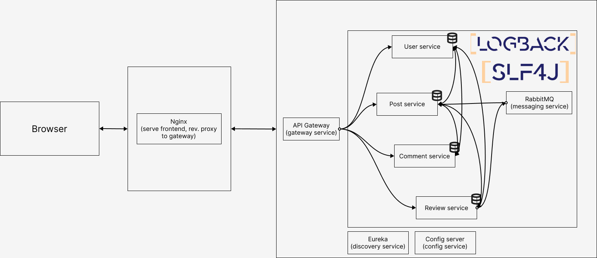

# Architecture

## User story documentatie

US 1: OpenFeign: PostService <-> UserService

US 2: OpenFeign: PostService <-> UserService

US 3: OpenFeign: PostService <-> UserService

US 4: Geen communicatie met andere services

US 5: OpenFeign: PostService <-> UserService => filteren op auteur

US 7: OpenFeign: PostService -> ReviewService, RabbitMQ: ReviewService -> PostService

US 8: RabbitMQ: ReviewService -> PostService

US 9: OpenFeign: PostService <-> ReviewService

US 10: OpenFeign: PostService <-> CommentService

US 11: OpenFeign: PostService <-> CommentService

US 12: OpenFeign: CommentService <-> UserService

## Omschrijving

Een browser stuurt requests naar Nginx om de frontend op te halen en ook om met de backend te communiceren. De gateway service verdeeld de backend requests naar de juiste microservice met behulp van de discovery service. De microservices communiceren met elkaar via sync (OpenFeign) en async (RabbitMQ) verbindingen. Elke microservice heeft zijn eigen database en beheert data die bij de functie van de microservice past. De config service biedt elke microservice een configuratie aan zodat er een gecentraliseerde config server is. Er wordt ook gebruik gemaakt van Logback en SLF4J voor de logging van de microservices.

